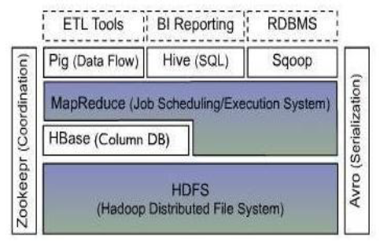
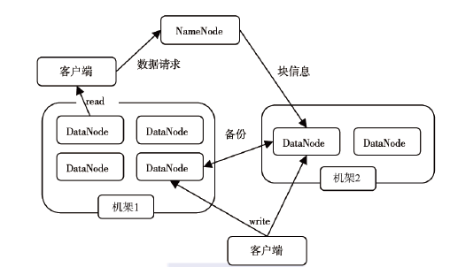
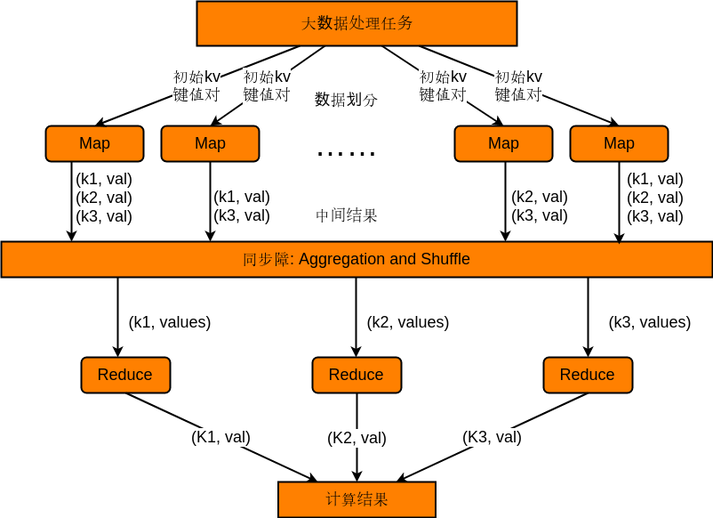
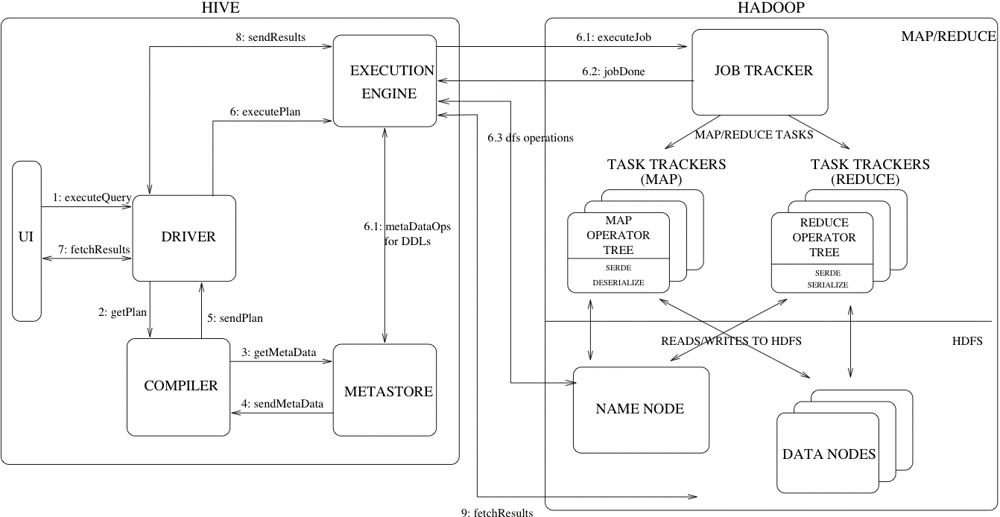
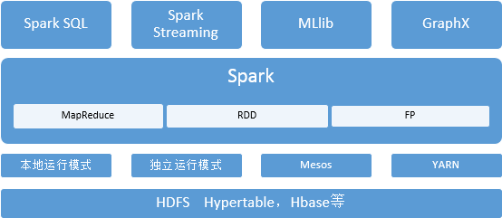

# 大数据管理与分析

## 考点

- HDFS 概念 or 编程 怎么保证可靠性 1道题
- mapreduce 2道题 并行化 算法
- hbase  概念, or 编程 1道题
- hive 数据库 偏概念 1道题
- spark 算法 1道题
- datamining 算法(单机) 1道题
- 第九章 预处理 策略 1道题
- 第十章 推荐系统 1道题
- 实验 1道题
- 预处理考察计算

## 大数据概述

#### 四个特征

- volume 大量化
- velocity 快速化
- variety 多样化
- value 价值

#### 大数据处理的基本流程

- 数据抽取与集成
- 数据分析
- 数据解释

#### 大数据处理模型

- 批处理：以静态数据为出发点，处理逻辑进来，算完价值出去
- 流数据处理：不变的是逻辑，动态数据进来，计算完后价值留下

## Hadoop

#### Hadoop 体系结构




- Avro是个数据序列化的系统，用于将数据对象转换成便于数据存储和网络传输的格
- HDFS是一种分布式文件系统，运行于大型商用机集群，HDFS提供了高可靠性的底层存储支持
- HBase位于结构化存储层，是一个分布式的列存储数据库
- MapReduce是一种分布式数据处理模式和执行环境
- Zookeeper是一个分布式的、高可用性的协调服务，提供分布式锁之类的基本服务
- Hive是一个建立在Hadoop 基础之上的数据仓库，用于管理存储于HDFS或Hbase中的结构化/半结构化数据
- Pig提供一种数据流语言，程序员可以将复杂的数据分析任务实现为Pig操作上的数据流脚本，这些脚本可自动转换为MapReduce任务链，在Hadoop上执行，从而简化程序员的数据分析工作难度
- Sqoop是SQL-to-Hadoop的缩写，为在RDBMS与Hadoop平台  （HDFS, Hbase, Hive）间进行快速批量数据交换

#### HDFS 的体系结构




一个HDFS集群是由一个NameNode和若干个DataNode组成NameNode作为主服务器，管理文件系统的命名空间和客户端对文件的访问操作；集群中的DataNode管理存储的数据HDFS支持用户以文件的形式存储数据，文件被分成若干个数据块，而且这若干个数据块存放在一组DataNode上

#### MapReduce 体系结构

- MapReduce框架是由一个单独运行在主节点上的JobTracker 和运行在每个集群从节点上的TaskTracker共同组成的主节点负责调度构成一个作业的所有任务，这些任务分布在不同的从节点上；
- 主节点监控它们的执行情况，并且重新执行之前失败的任务。从节点仅负责由主节点指派的任务
- 当一个Job 被提交时，JobTracker接收到提交作业和配置信息之后，就会将配置信息等分发给从节点，同时调度任务并监控TaskTracker的执行

HDFS和MapReduce共同组成了Hadoop分布式系统体系结构的核心

```
基于MapReduce的处理过程示例--文档词频统计：WordCount
设有4组原始文本数据：
Text 1: the weather is good         Text 2: today is good     
Text 3: good weather is good      Text 4: today has good weather
MapReduce处理方式
使用4个map节点：
map节点1: 	输入：(text1, “the weather is good”)
             输出：(the, 1), (weather, 1), (is, 1), (good, 1)
map节点2: 	输入：(text2, “today is good”)
             输出：(today, 1), (is, 1), (good, 1)
map节点3: 	输入：(text3, “good weather is good”)
             输出：(good, 1), (weather, 1), (is, 1), (good, 1)
map节点4: 	输入：(text3, “today has good weather”)
             输出：(today, 1), (has, 1), (good, 1), (weather, 1)
使用3个reduce节点：
reduce节点1: 
	输入：(good, 1), (good, 1), (good, 1), (good, 1), (good, 1)
	输出：(good, 5)
reduce节点2: 
	输入：(has, 1), (is,1), (is,1), (is, 1), 
    输出：(has, 1), (is, 3)
reduce节点3: 
	输入：(the, 1), (today, 1), (today, 1) (weather, 1), (weather,1), (weather, 1)
    输出：(the, 1), (today, 2), (weather, 3)

```

- MapReduce 编程模型的原理是：利用一个输入的key/value 对集合,来产生一个输出的key/value 对集合。这个过程基于Map 和Reduce这两个用户自定义函数实现
- 用户自定义的map函数接收一个输入的key/value 对，然后产生一个中间key/value 对的集合
- MapReduce（shuffle）把所有具有相同key值的value集合在一起，然后传递给reduce 函数
- 用户自定义的reduce 函数接收key和相关的value集合，合并这些value 值，形成一个较小的value 集合。一般来说，每次reduce 函数调用只产生0 或1 个输出的value值
- 通常通过一个迭代器把中间的value 值提供给reduce 函数，这样就可以处理无法全部放入内存中的大量的value 值集合

大数据存储 ==> 初始 kv 键值对(Map) ==> 中间结果 (Aggregation and Shuffle) ==> Reduce

## HDFS

HDFS体系结构中有两类节点，NameNode和DataNode，分别承担Master和Worker的任务

- 目录节点（NameNode）是集群里面的主节点，负责管理整个HDFS系统的命名空间和元数据，也是客户端访问HDFS系统的入口命名空间，即整个系统的目录结构；
  - 命名空间的维护操作包括文件和目录的创建、删除、重命名等
  - 数据块与文件名的映射表，客户端需要访问目录节点才能知道一个文件的所有数据块都保存在哪些数据节点上
  - 每个数据块副本的位置信息，每个数据块默认有3个副本，应用程序可以指定某一个文件在HDFS中保存多少份，这称为“副本因子”(Replication Factor)，该信息也保存在目录节点里面

#### HDFS 的通信协议

HDFS的通讯协议基本是在TCP/IP的基础上开发的

- 客户端使用Client协议和目录节点通讯
- 目录节点和数据节点使用Datanode协议交互
- 客户端和数据节点的交互是通过远程过程调用(RPC, Remote Procedure Call)

#### HDFS  可靠性设计

- 数据异常
  - 客户端在创建文件的时候，HDFS会为文件生成一个校验和(CheckSum), 校验和文件与文件本身保存在同一个空间中。数据传输时，将数据与校验和一起传输，客户端对每个读取的数据块进行教研
  - 如果校验结果出错，客户端就会请求到另一个数据节点读取该文件块，并且报告给目录节点这个文件块有错误，目录节点会重新复制这个块
- 目录节点出错
  - HDFS 刚启动时，目录节点进入安全模式(safe mode), 此时不做任何文件修改操作；目录节点和各个数据节点通信，获得数据块信息，并对数据块信息进行检查；认为安全的块比例超过阈值，才退出安全模式
  - 辅助目录节点，用来备份目录节点的元数据，当目录节点失效时，从辅助目录节点恢复出目录节点的元数据
  - 文件镜像数据FsImage和编辑日志数据Editlog是目录节点元数据中最重要的部分，前者相当于HDFS的检查点，后者记录对HDFS的最新修改信息
  - 目录节点启动时，读取FsImage的内容到内存，并将其与Editlog中的所有修改信息合并生成最新的FsImage；目录节点运行中，所有关于HDFS的修改信息，都将写入Editlog
  - FsImage和Editlog是目录节点上两个最核心的数据结构，如果其中一个文件出错的话，会造成目录节点不起作用
  - 目录节点上可以设置多个备份文件，以及在辅助目录节点进行备份，当这两个文件有所改变时，目录节点就会发起同步操作，虽然这样增加了系统的负担，但是为了实现数据的可靠性，这个同步操作是非常必要的。

HDFS 的容错性手段

- 在目录节点和数据节点之间维护心跳检测
- 检测文件块的完整性
- 集群的负载均衡
- 维护多个FsImage和Editlog的拷贝

#### 分布式文件系统的设计要求

- 透明性
- 并发控制
- 文件复制功能
- 硬件和操作系统的异构性
- 容错能力
- 安全性问题

#### HDFS 的基本特征

- 大规模数据分布存储能力
- 高并发访问能力
- 强大的容错能力
- 顺序式文件访问
- 简单的一致性模型（一次写多次读）
- 数据库存储模式

## HDFS编程

- FileSystem 基类

  - FileSystem是一个用来与文件系统交互的抽象类，可以通过实现FileSystem的子类来处理具体的文件系统，比如HDFS或者其它文件系统

  - 通过factory方法FileSystem.get(Configuration conf)获得所需的文件系统实例   

    ```java
    Configuration conf = new Configuration();   
    FileSystemhdfs = FileSystem.get(conf);
    ```

  - Hadoop中，使用Path类的对象来编码目录或者文件的路径，使用FileStatus类来存放目录和文件的信息。

- 创建文件

  - create

  ```java
  public FSDataOutputStream create(Path f);
  public FSDataOutputStream create(Path f, boolean overwrite);
  public FSDataOutputStream create(Path f, boolean overwrite, int bufferSize);
  ```

- 打开文件

  - open

  ```java
  public abstract FSDataInputStream open(Path f, int bufferSize) throws IOException
  ```

- 获取文件信息

  - getFileStatus

  ```java
  public abstract FileStatus getFileStatus(Path f) throws IOException;
  /**
     path：文件路径
     length：文件长度
     isDir：是否为目录
     block_replication: 数据块副本因子
     blockSize：文件长度（数据块数）
     modification_time: 最近一次修改时间
     access_time: 最近一次访问时间
     owner：文件所属用户
     group：文件所属组
  */
  ```

- 获取目录信息

  ```java
  public FileStatus[] listStatus (Path f) throws IOException;
  ```

- 文件读取

  ```java
  public int read(long position, byte[] buffer, int offset, int length) throws IOException;
  public final int read(byte[] b) throws IOException
  ```

- 文件写入

  ```java
  public void write(byte[] b, int off, int len) throws IOException
  ```

- 关闭

  ```java
  public void close() throws IOExcpetion
  ```

- 删除

  ```java
  public abstract boolean delete(Path f, boolean recursive) throws IOException;
  public boolean deleteOnExit(Path f) throws IOException;
  ```

```java
// HDFS编程实例
/** 获取一个指定HDFS目录下所有文件的信息，对每一个文件，打开文件、循环读取数据、写入目标位置，然后关闭文件，最后关闭输出文件。 */
import *
public class resultFilter
{	
   public static void main(String[] args) throws IOException 
   {		
      Configuration conf = new Configuration();	//以下两句中，hdfs和local分别对应HDFS实例和本地文件系统实例	
      FileSystem hdfs = FileSystem.get(conf);		
      FileSystem local = FileSystem.getLocal(conf); 	  
      Path inputDir, localFile;				
      FileStatus[] inputFiles;		
      FSDataOutputStream out = null;
      FSDataInputStream in = null;		
      Scanner scan; String str; byte[] buf;	int singleFileLines; int numLines,numFiles,i;	
      inputDir = new Path(args[0]);
 	  singleFileLines = Integer.parseInt(args[3]);
 try {  
       inputFiles = hdfs.listStatus(inputDir);   //获得目录信息	
       numLines = 0;	 numFiles = 1;    //输出文件从1开始编号		
       localFile = new Path(args[1]);		
       if(local.exists(localFile)) local.delete(localFile, true);  //若目标路径存在，则删除之	
	   for (i = 0; i<inputFiles.length; i++) {				
           if(inputFiles[i].isDir() == true)  //忽略子目录				
           continue;
           System.out.println(inputFiles[i].getPath().getName());		
           in = hdfs.open(inputFiles[i].getPath());
           scan = new Scanner(in);		
           while (scan.hasNext()) {	
              str = scan.nextLine();			
              if(str.indexOf(args[2])==-1) continue;  //如果该行没有match字符串，则忽略
              numLines++;			
              if(numLines == 1)    //如果是1，说明需要新建文件了			
              {  localFile = new Path(args[1] + File.separator + numFiles);			 
                 out = local.create(localFile); //创建文件			
                 numFiles++;			
              }			
              buf = (str+"\n").getBytes();			
              out.write(buf, 0, buf.length);   //将字符串写入输出流			
              if(numLines == singleFileLines) //如果已满足相应行数，关闭文件			
                 { out.close();  numLines = 0;   //行数变为0，重新统计	}		
           }//end of while
           scan.close();  in.close();
   	    }//end of for		
        if(out != null)	out.close();		
        } //end of try
        catch (IOException e) { e.printStackTrace();}
   } //end of main
} //end of resultFilter

```


## MapReduce



- map (k1; v1) -> [(k2; v2)]
  - 输入：键值对(k1; v1)表示的数据
  - 处理：文档数据记录将以“键值对”形式传入map函数；map函数将处理这些键值对，并以另一种键值对形式输出处理的一组键值对中间结果[(k2; v2)]
  - 输出：键值对[(k2; v2)]表示的一组中间数据
- reduce (k2; [v2]) -> [(k3; v3)]
  - 输入：由map输出的一组键值对[(k2; v2)] 将被进行合并处理将同样主键下的不同数值合并到一个列表[v2]中，故reduce的输入为(k2; [v2])
  - 处理：对传入的中间结果列表数据进行某种整理或进一步的处理，并产生最终的某种形式的结果输出[(k3; v3)]
  - 输出：最终输出结果[(k3; v3)]

#### 词频统计

- 传统串行处理

```java
String text[] = new String[] {"",...}
HashTable ht = new HashTable();
for (i=0; i<3; ++i) {
  StringTokenizer st = new StringTokenizer(text[i]);
  while(st.hasMoreTokens()) {
    String word = st.nextToken();
    if(!ht.containsKey(word))
      ht.put(word, new Integer(1));
    else {
      int wc = ((Integer)ht.get(word).intValue() + 1;
      ht.put(word, new Integer(wc));
    }
  } // enf of while
} // end of for
```

- 并行

```java
public static class TokenizerMapper extends Mapper<Object, Text, Text, IntWritable> {
  private final static IntWritable one = new IntWritable(1);
  private Text word = new Text();
  // 词频统计map
  public void map(Object key, Text value, Context context) throws IOException, InterruptedException {
    StringTokenizer itr = new StringTokenizer(value.toString());
    while(itr.hasMoreTokens()) {
      word.set(itr.nextToken());
      context.write(word, one);
    }
  }
}
// p117
public static class IntSumReducer extends Reducer<Text, IntWritable, Text, IntWritable> {
  private IntWritable result = new IntWritable();
  public void reduce(Text key, Iterable<IntWritable> values, Context context) throws IOException, InterruptedException {
    int sum = 0;
    for (IntWritable val : values) {
      sum += val.get();
    }
    result.set(sum);
    context.write(key, result);
  }
}
```


#### 倒排索引

- 并行

```java
public class InvertedIndexMapper extends Mapper<Text, Text, Text, Text> {
  protected void map(Text key, Text value, Context context) throws IOException, Interrupted Exception {
    Text word = new Text();
    // get fileName by fileSplit
    FileSplit fileSplit = (FileSplit)context.getInputSplit();
    String fileName = fileSplit.getPath().getName();
    Text fileName_lineOffset = new Text(fileName + "#" + key.toString());
    StringTokenizer itr = new StringTokenizer(value.toString());
    for(; itr.hasMoreTokens();) {
      word.set(itr.nextToken());
      context.write(word, fileName_lineOffset);
    }
  }
}
public class InvertedIndexReducer extends Reducer<Text, Text, Text, Text> {
  protected void reduce(Text key, Iterable<Text> values, Context context) throws IOException, InterruptedException {
    Iterator<Text> it = values.iterator();
    StringBuilder all = new StringBuilder();
    if(it.hasNext())
      all.append(it.next().toString());
    for (; it.hasNext(); ) {
      all.append(";");
      all.append(it.next().toString());
    }
    context.write(key, new Text(all.toString()));
  }//最终输出键值对示例：(“fish", “doc1#0;doc1#8;doc2#0;doc2#8")
}

public class InvertedIndex {
  public static void main(String[] args) {
    try{
      Configuration conf = new Configuration();
      job = new Job(conf, "invert index");
      job.setJarByClass(InvertedIndexer.class);
      job.setInputFormatClass(TextInputFormat.class);
      job.setMapperClass(InvertedIndexMapper.class);
      job.setReducerClass(InvertedIndexReducer.class);
      job.setOuputKeyClass(Text.class);
      job.setOutputValueClass(Text.class);
      FileInputFormat.addInputPath(job, new Path(args[0]));
      FileOuputFormat.setOutputPath(job, new Path(args[1]));
      System.exit(job.waitForCompletion(true)?0:1);
    } catch (Exception e) {
      e.printStackTrace();
    }
  }
}
```

#### 矩阵乘法 

```
算法思想
Map函数： 对于矩阵M中的每个元素m_ij,产生一系列的key-value对<(i,k),(M, j, m_ij)>,其中k=1,2...直到矩阵N的总列数；对于矩阵N中的每个元素n_jk,产生一系列的key-value对<(i,k),(N, j, n_jk)>,其中i=1,2...直到矩阵M的总行数。
Reduce函数：对于每个键(i,k)相关联的值(M, j, m_ij)及(N, j, n_jk),根据相同的j值将m_ij和n_jk分别存入不同的数组中，然后将两者的第j个元素抽取出来分别相乘，最后相加，即可得到p_ik的值。
```

## Hbase

- 构建于分布式文件系统hdfs之上
- 为上层应用提供结构化半结构化海量数据存储访问能力
- 可与MapReduce协同工作，为MapReduce提供数据输入输出，以完成数据的并行化处理

#### HBase 的数据模型

- 分布式多维表，表中的数据通过一个行关键字，一个列族和列名以及一个时间戳进行索引和查询定位
- 查询模式
  - 通过单个 row key 访问
  - 通过 row key 的范围来访问
  - 全表扫描

#### HBase 的基本架构与数据存储管理方法

- HBase 的运行依赖与Hadoop HDFS文件系统提供数据的持久化，依赖Zookeeper提供集群的同步和协调
- 由一个MasterServer和由一组子表数据区服务器RegionServer构成，分别存储逻辑大表中的部分数据 大表中的底层数据存于HDFS中
- HBase 的基本组成机构
  - HBase Master. Master是HBase集群的主控服务器，负责集群状态的管理维护。Master可以有多个，但只有一个是活跃的。它的具体职责有:
    1. 为Region Server 分配Region
    2. 负责 Region Server 的负载均衡
    3. 发现失效的Region Server并重新分配其上的Region
    4. HDFS上的垃圾文件回收
    5. 处理shcema更新请求
  - HBase Region Server. Region Server 是 HBase 具体对外提供服务的进程。
    1. Region Server 维护 Master 分配给它的 Region, 处理对这些Region的 I/O 请求
    2. Region Server 负责切分在运行过程中变得过大的 Region
- HBase Region
  - 每个字表中的数据区Region由很多个数据存储快Store构成
  - 每个Store数据块由存放在内存中的memStore和存放在文件中的StoreFile构成
  - Region 是 HBase 调度的基本单位
  - 当某个Store 的所有StoreFile大小之和超过阈值，该Store所在的Region就会被分裂成两个Region，从而保证每个Store都不会过大。
- HBase 数据的访问
  - 当客户端需要进行数据更新时，先查到子表服务器,然后向子表提交数据更新请求。提交的数据并不直接存储到磁盘上的数据文件中，而是添加到一个基于内存的子表数据对象memStore中，当memStore中的数据达到一定大小时，系统将自动将数据写入到文件数据块StoreFile中
  - 每个文件数据块StoreFile最后都写入到底层基于HDFS的文件中
  - 需要查询数据时，子表先查memStore。如果没有，则再查磁盘上的StoreFile。每个StoreFile都有类似B树的结构，允许进行快速的数据查询。StoreFile将定时压缩，多个压缩为一个
  - 两个小的子表可以进行合并
  - 子表大到超过某个指定值时，子表服务器就需要调用HRegion.closeAndSplit(),把它分割为两个新的子表
- HBase 数据记录的查询定位
  - 描述所有子表和子表中数据块的元数据都存放在专门的元数据表中，并存储在特殊的子表中。子表元数据会不断增长，因此会使用多个子表来保存
  - 所有元数据子表的元数据都保存在根子表中。主服务器会扫描根子表，从而得到所有的元数据子表位置，再进一步扫描这些元数据子表可获得所寻找子表的位置
  - 元数据子表采用三级索引结构：
    - 根子表->用户表的元数据表->用户表

#### HBase 操作命令

```
- 创建表
create 'test', 'cf'
- 插入数据
put 'test', 'row1', 'cf:a', 'value1'
- 读出数据
scan 'test'
count 'test', 'cf:a'
get 'test', row2'
- 更新数据
put 'test', 'row1', 'cf:a', 'value5'
- 删除数据
disable 'test'
drop 'test'
```

#### HBase 编程

```java
// 创建表
HBaseAdmin hAdmin = new HBaseAdmin(hbaseeConfig);
HTableDescriptor t = new HTableDescriptor(tableName);
t.addFamily(new HColumnDescriptor("f1"));
hAdmin.createTable(t);
// 插入数据
public static void addData(String tableName, String rowKey, String family, String qualifier, String value) throws Exception {
  try{
    HTable table = new HTable(conf, tableName);
    Put put = new Put(Bytes.toBytes(rowKey));
    put.add(Bytes.toBytes(family), Bytes.toBytes(qualifier), Bytes.toBytes(value));
    System.out.println("Insert recored success!");
  } catch(IOException) {e.printStackTrace();}
}
// 删除表
if (hAdmin.tableExits(tableName)) {
  hAdmin.disableTable(tableName);
  hAdmin.deleteTable(tableName);
}
// 查询数据
Scan s = new Scan();
s.setMaxVersions();
ResultScanner ss = table.getScanner(s);
for(Result r:ss) {
  System.out.println(new String(r.getRow()));
  for(KeyValue kv:r.raw()) {
    System.out.println(new String(kv.getColumn()));
  }
}
// 删除数据
HTable table = new HTable(hbaseConfig, "mytest");
Delete d = new Delete("row1".getBytes());
table.delete(d)
```

```java
// lin-ziyu 源码
import org.apache.hadoop.conf.Configuration;
import org.apache.hadoop.hbase.*;
import org.apache.hadoop.hbase.client.*;
import java.io.IOException; 
public class HBaseOperation{
    public static Configuration configuration;
    public static Connection connection;
    public static Admin admin;
    public static void main(String[] args)throws IOException{
        createTable("t2",new String[]{"cf1","cf2"});
        insertRow("t2", "rw1", "cf1", "q1", "val1");
        getData("t2", "rw1", "cf1", "q1");
        //deleteTable("t2");  //如果不想执行本行代码，可以注释掉本行代码
    } 
    //建立连接
    public static void init(){
        configuration  = HBaseConfiguration.create();
        configuration.set("hbase.rootdir","hdfs://localhost:9000/hbase");
        try{
            connection = ConnectionFactory.createConnection(configuration);
            admin = connection.getAdmin();
        }catch (IOException e){
            e.printStackTrace();
        }
    }
    //关闭连接
    public static void close(){
        try{
            if(admin != null){
                admin.close();
            }
            if(null != connection){
                connection.close();
            }
        }catch (IOException e){
            e.printStackTrace();
        }
    }
    //建表
    public static void createTable(String myTableName,String[] colFamily) throws IOException { 
        init();
        TableName tableName = TableName.valueOf(myTableName); 
        if(admin.tableExists(tableName)){
            System.out.println("talbe is exists!");
        }else {
            HTableDescriptor hTableDescriptor = new HTableDescriptor(tableName);
            for(String str:colFamily){
                HColumnDescriptor hColumnDescriptor = new HColumnDescriptor(str);
                hTableDescriptor.addFamily(hColumnDescriptor);
            }
            admin.createTable(hTableDescriptor);
        }
        close();
    }
    //删表
    public static void deleteTable(String tableName) throws IOException {
        init();
        TableName tn = TableName.valueOf(tableName);
        if (admin.tableExists(tn)) {
            admin.disableTable(tn);
            admin.deleteTable(tn);
        }
        close();
    } 
    //查看已有表
    public static void listTables() throws IOException {
        init();
        HTableDescriptor hTableDescriptors[] = admin.listTables();
        for(HTableDescriptor hTableDescriptor :hTableDescriptors){
            System.out.println(hTableDescriptor.getNameAsString());
        }
        close();
    }
    public static void insertRow(String tableName,String rowKey,String colFamily,String col,String val) throws IOException {
        init();
        Table table = connection.getTable(TableName.valueOf(tableName));
        Put put = new Put(rowKey.getBytes());
        put.addColumn(colFamily.getBytes(), col.getBytes(), val.getBytes());
        table.put(put);
        table.close();
        close();
    }
    //删除数据
    public static void deleteRow(String tableName,String rowKey,String colFamily,String col) throws IOException {
        init();
        Table table = connection.getTable(TableName.valueOf(tableName));
        Delete delete = new Delete(rowKey.getBytes());
        //删除指定列族
        //delete.addFamily(Bytes.toBytes(colFamily));
        //删除指定列
        //delete.addColumn(Bytes.toBytes(colFamily),Bytes.toBytes(col));
        table.delete(delete);
        table.close();
        close();
    }
    //根据rowkey查找数据
    public static void getData(String tableName,String rowKey,String colFamily,String col)throws  IOException{
        init();
        Table table = connection.getTable(TableName.valueOf(tableName));
        Get get = new Get(rowKey.getBytes());
        get.addColumn(colFamily.getBytes(),col.getBytes());
        Result result = table.get(get);
        showCell(result);
        table.close();
        close();
    }
    //格式化输出
    public static void showCell(Result result){
        Cell[] cells = result.rawCells();
        for(Cell cell:cells){
            System.out.println("RowName:"+new String(CellUtil.cloneRow(cell))+" ");
            System.out.println("Timetamp:"+cell.getTimestamp()+" ");
            System.out.println("column Family:"+new String(CellUtil.cloneFamily(cell))+" ");
            System.out.println("row Name:"+new String(CellUtil.cloneQualifier(cell))+" ");
            System.out.println("value:"+new String(CellUtil.cloneValue(cell))+" ");
        }
    }
}
```

- put 插入或更新
- delete 删除
- append 添加
- increment 增长

## Hive 

- 数据仓库 

  数据仓库是一个面向主题的，集成的，时变的，非易失性的数据集合，用于支持管理决策过程

- OLTP vs. OLAP (联机事务处理 vs. 联机分析处理)

#### Hive 基本工作原理

- 使用Hadoop 进行数据分析
- Hive 可以被认为是一种数据仓库，包括数据的存储以及查询
- Hive 包括一个高层语言的执行引擎，类似于SQL的执行引擎
- Hive 建立在 Hadoop 的其他组成部分之上，包括 Hive 依赖于 HDFS 进行数据保护，依赖于 MapReduce 完成查询操作
- Hive 和 HBase 的区别
  - HBase是一种NoSQL数据库，最常见的应用场景是采集的网页数据的存储由于是key-value型数据库，可以再扩展到各种key-value应用场景，如日志信息的存储HBase主要针对OLTP应用
  - Hive是一个构建与Hadoop顶层的数据仓库工具，对存储在Hadoop文件中的数据集进行数据整理、查询和分析处理Hive提供一个统一的查询分析层，支撑连接、分组、聚集等类SQL语句，可以看作是用户编程接口Hive主要针对OLAP应用
- Hive 构建于分布式文件系统 HDFS 之上，将类 SQL 查询转换为 MapReduce 操作

#### Hive 的组成模块

Hive的模块非常类似于传统的数据库的模块，下面是Hive的必要组成模块以及对应的功能介绍

- HiveQL：这是Hive的数据查询语言，与SQL非常类似。Hive提供了这个数据查询语言与用户的接口，包括一个shell的接口，可以进行用户的交互，以及Web接口和JDBC接口。JDBC接口可以用于编程，与传统的数据库编程类似，使得程序可以直接使用Hive功能而无需更改
- Driver:执行驱动程序，用以将各个组成部分形成一个有机的执行系统，包括会话的处理，查询获取以及执行驱动
- Compiler：Hive需要一个编译器，将HiveQL语言编译成中间表示，包括对于HiveQL语言的分析，执行计划的生成以及优化等工作
- ExecutionEngine：执行引擎，在Driver的驱动下，具体完成执行操作，包括MapReduce执行，或者HDFS操作，或者元数据操作
- Metastore：用以存储元数据：存储操作的数据对象的格式信息，在HDFS中的存储位置的信息以及其他的用于数据转换的信息等

#### Hive 的系统结构



#### Hive 的数据模型

每一个类似于数据库的系统都首先需要定义一个数据模型，然后才是在这个数据模型之上的各种操作

- Tables：Hive的数据模型由数据表组成

  数据表中的列是有类型的（int,float, string, data, boolean）

  也可以是复合的类型，如list:map （类似于JSON形式的数据）

- EXTERNALTables：Hive的数据模型由数据表组成

  数据不在Hive的warehouse目录内，需要到目录以外位置访问数据

- Partitions：数据表可以按照一定的规则进行划分Partition

  例如，通过日期的方式将数据表进行划分

- Buckets：数据存储的桶

  在一定范围内的数据按照Hash的方式进行划分（这对于数据的抽样以及对于join的优化很有意义）

- 元数据存储

  - 在Hive中由一系列的数据表格组成一个命名空间，关于这个命名空间的描述信息会保存在Metastore的空间中
  - 元数据使用SQL的形式存储在传统的关系数据库中，因此可以使用任意一种关系数据库，例如Derby(apache的关系数据库实现)，MySQL以及其他的多种关系数据库存储方法
  - 在数据库中，保存最重要的信息是有关数据库中的数据表格描述，包括每一个表的格式定义，列的类型，物理的分布情况，数据划分情况等

## Spark

Spark 提出一种基于内存的弹性分布式数据集(RDD), 通过对RDD的一系列操作完成计算任务，可以大大提高性能

#### spark的基本构架



#### spark 编程示例

```scala
def main(args: Array[String]) {
  val conf = new SparkConf().setAppName("Spark Pi")
  val sc = new SparkContext(conf)
  val fileRDD = sc.textFile("hdfs:///root/log")
  val filterRDD = fileRDD.filter(line=>line.contains("ERROR"))
  val result = filterRDD.count()
  sc.stop()
}
```

| Transformation                          | Meaning                                  |
| --------------------------------------- | ---------------------------------------- |
| map(func)                               | Return a new distributed dataset formed by passing each element of the source through a function func. |
| filter(func)                            | Return a new dataset formed by selecting those elements of the source on which func returns true. |
| flatMap(func)                           | Similar to map, but each input item can be mapped to 0 or more output items (so func should return a Seq rather than a single item). |
| mapPartitions(func)                     | Similar to map, but runs separately on each partition (block) of the RDD, so func must be of type Iterator<T> => Iterator<U> when running on an RDD of type T. |
| mapPartitionsWithIndex(func)            | Similar to mapPartitions, but also provides func with an integer value representing the index of the partition, so func must be of type (Int, Iterator\<T>) => Iterator\<U> when running on an RDD of type T. |
| sample(withReplacement, fraction, seed) | Sample a fraction of the data, with or without replacement, using a given random number generator seed. |
| union(otherDataset)                     | Return a new dataset that contains the union of the elements in the source dataset and the argument. |

| Transformation                           | Meaning                                  |
| ---------------------------------------- | ---------------------------------------- |
| intersection(otherDataset)               | Return a new RDD that contains the intersection of elements in the source dataset and the argument. |
| distinct([numTasks]))                    | Return a new dataset that contains the distinct elements of the source dataset. |
| groupByKey([numTasks])                   | When called on a dataset of (K, V) pairs, returns a dataset of (K, Iterable\<V>) pairs. |
| reduceByKey(func, [numTasks])            | When called on a dataset of (K, V) pairs, returns a dataset of (K, V) pairs where the values for each key are aggregated using the given reduce function func, which must be of type (V,V) => V. Like in groupByKey, the number of reduce tasks is configurable through an optional second argument. |
| aggregateByKey(zeroValue)(seqOp, combOp, [numTasks]) | When called on a dataset of (K, V) pairs, returns a dataset of (K, U) pairs where the values for each key are aggregated using the given combine functions and a neutral "zero" value. Allows an aggregated value type that is different than the input value type, while avoiding unnecessary allocations. Like in groupByKey, the number of reduce tasks is configurable through an optional second argument. |
| sortByKey([ascending], [numTasks])       | When called on a dataset of (K, V) pairs where K implements Ordered, returns a dataset of (K, V) pairs sorted by keys in ascending or descending order, as specified in the boolean ascending argument. |

| Transformation                           | Meaning                                  |
| ---------------------------------------- | ---------------------------------------- |
| join(otherDataset, [numTasks])           | When called on datasets of type (K, V) and (K, W), returns a dataset of (K, (V, W)) pairs with all pairs of elements for each key. Outer joins are supported through leftOuterJoin,rightOuterJoin, and fullOuterJoin. |
| cogroup(otherDataset, [numTasks])        | When called on datasets of type (K, V) and (K, W), returns a dataset of (K, (Iterable\<V>, Iterable\<W>)) tuples. This operation is also called groupWith. |
| cartesian(otherDataset)                  | When called on datasets of types T and U, returns a dataset of (T, U) pairs (all pairs of elements). |
| pipe(command, [envVars])                 | Pipe each partition of the RDD through a shell command, e.g. a Perl or bash script. RDD elements are written to the process's stdin and lines output to its stdout are returned as an RDD of strings. |
| coalesce(numPartitions)                  | Decrease the number of partitions in the RDD to numPartitions. Useful for running operations more efficiently after filtering down a large dataset. |
| repartition(numPartitions)               | Reshuffle the data in the RDD randomly to create either more or fewer partitions and balance it across them. This always shuffles all data over the network. |
| repartitionAndSortWithinPartitions(partitioner) | Repartition the RDD according to the given partitioner and, within each resulting partition, sort records by their keys. This is more efficient than calling repartition and then sorting within each partition because it can push the sorting down into the shuffle machinery. |

| Action                                  | Meaning                                  |
| --------------------------------------- | ---------------------------------------- |
| reduce(func)                            | Aggregate the elements of the dataset using a function func (which takes two arguments and returns one). The function should be commutative and associative so that it can be computed correctly in parallel. |
| collect()                               | Return all the elements of the dataset as an array at the driver program. This is usually useful after a filter or other operation that returns a sufficiently small subset of the data. |
| count()                                 | Return the number of elements in the dataset. |
| first()                                 | Return the first element of the dataset (similar to take(1)). |
| take(n)                                 | Return an array with the first n elements of the dataset. |
| takeSample(withReplacement,num, [seed]) | Return an array with a random sample of num elements of the dataset, with or without replacement, optionally pre-specifying a random number generator seed. |
| takeOrdered(n, [ordering])              | Return the first n elements of the RDD using either their natural order or a custom comparator. |

| Action                                   | Meaning                                  |
| ---------------------------------------- | ---------------------------------------- |
| saveAsTextFile(path)                     | Write the elements of the dataset as a text file (or set of text files) in a given directory in the local filesystem, HDFS or any other Hadoop-supported file system. Spark will call toString on each element to convert it to a line of text in the file. |
| saveAsSequenceFile(path) (Java and Scala) | Write the elements of the dataset as a Hadoop SequenceFile in a given path in the local filesystem, HDFS or any other Hadoop-supported file system. This is available on RDDs of key-value pairs that either implement Hadoop's Writable interface. In Scala, it is also available on types that are implicitly convertible to Writable (Spark includes conversions for basic types like Int, Double, String, etc). |
| saveAsObjectFile(path) (Java and Scala)  | Write the elements of the dataset in a simple format using Java serialization, which can then be loaded using SparkContext.objectFile(). |
| countByKey()                             | Only available on RDDs of type (K, V). Returns a hashmap of (K, Int) pairs with the count of each key. |
| foreach(func)                            | Run a function func on each element of the dataset. This is usually done for side effects such as updating an accumulator variable (see below) or interacting with external storage systems. |

##### wordcount

```scala
val file = spark.textFile("hdfs://...")
val counts = file.flatMap(line=>line.split(" ")).map(word=>(word, 1))
						.reduceByKey(_+_)
counts.saveAsTextFile("hdfs://...")
```

##### k-means

````scala
// 读取数据和初始化聚类中心
val lines = sc.textFile("data/mllib/kmeans_data.txt")
val data = lines.map(s=>s.split(" ").map(_.toDouble)).cache()
val kPoints = data.takeSample(false, K, 42).map(s=>spark.util.Vectors(s))
// takeSample(Boolean, Int, long)采样函数，false表示不适用替代方法采样，k表示样本数，42表示随机种子
// 划分数据给聚类中心
val closest = data.map(p=>(closestPoint(spark.util.Vector(p), kPoints),))
// 聚合生成新的聚类中心
val pointStats = closest.reduceByKey{
  case((x1, y1), (x2, y2)) => (x1+x2, y1+y2)
}
val newPoints = pointStats.map{
  pair => (pair._1, pair._2._1/pair._2._2)
}.collectAsMap()

````

##### PageRank

```scala
 def main(args: Array[String]){
    val conf = new SparkConf().setAppName("PageRank").setMaster("local")
    val sc = new SparkContext(conf)

    val hdfs = FileSystem.get(URI.create("hdfs://10.102.0.197:9000/Experiment_3/DataSet"), new Configuration)
    var fp : FSDataInputStream = hdfs.open(new Path("hdfs://10.102.0.197:9000/Experiment_3/DataSet"))
    var isr : InputStreamReader = new InputStreamReader(fp)
    var bReader : BufferedReader = new BufferedReader(isr)
    var line:String = bReader.readLine();

    var tot_links = List(("",List("a")));
    while(line!=null) {
      var tmpList = List((line.split("\t")(0), line.split("\t")(1).split(",").toList))
            tot_links = tot_links ++ tmpList
        line = bReader.readLine();
    }
    isr.close();
    bReader.close();

    tot_links = tot_links.drop(1);

    val links = sc.parallelize(tot_links).persist();
  
    var ranks = links.mapValues(v => 1.0); 
  
    for (i <- 0 until 10) {  
      val contributions=links.join(ranks).flatMap {  
        case (pageId,(links,rank)) => links.map(dest=>(dest,rank/links.size))  
      }  
      ranks=contributions.reduceByKey((x,y)=>x+y).mapValues(v=>0.15+0.85*v)  
    }

    val output = ranks.collect.sortWith{  
          case (a,b)=>{  
      a._2>b._2 //否则第三个字段降序  
          }  
        }
    // 结果存储在output中
    val outputPath = new Path("hdfs://10.102.0.197:9000/user/201500130058/Experiment_3_Spark");
    val outputWriter = new PrintWriter(hdfs.create(outputPath)) ;
    for(i<-0 to output.length-1){
        outputWriter.write("("+output(i)._1 + "," +"%11.10f".format(output(i)._2)+")\n");
    }
    outputWriter.close();
        sc.stop()
    }
```

## Data Mining

#### k-means

```
输入：待聚类的N个数据点，期望生成的聚类的个数K
输出：K个聚类
算法描述:
    选出K个点作为初始的cluster center
    Loop:
       对输入中的每一个点p：
     ｛   
          计算p到各个cluster的距离；
          将p归入最近的cluster;
      ｝
       重新计算各个cluster的中心
     
       如果不满足停止条件，goto Loop; 否则，停止
```

- mapper
- combiner
- reducer

#### k-nn

```
Map阶段对每个读出的测试样本数据ts(trid,A’,y’）
- 计算其与每个训练样本数据tr(trid,A,y)之间的相似度S=Sim(A’,A）（1：相似度最大，0：相似度最小）
- 检查S是否比目前的k个S值中最小的大，若是则将(S,y)计入k个最大者
- 根据所保留的k个S值最大的(S,y)，根据模型y'=∑Si*yi/∑Si计算出ts的分类标记值y’，发射出(tsid, y’)
Reduce阶段直接输出(tsid, y’)
yi为选取出的最邻近训练样本的分类标记值
```

```
// Mapper伪代码
class Mapper
  setup(…)
  {
       读取全局训练样本数据文件，转入本地内存的数据表TR中
  }
  map(key, ts)  // ts为一个测试样本
   {  Φ -> MaxS (k)
      ts -> tsid, A’, y’
       for i=0 to TR.length()
       {   TR[i] -> trid, A, y
           S = Sim(A, A’);
           若S属于k个最大者， (S, y) -> MaxS;
       }  
      根据MaxS和带加权投票表决模型计算出y’=∑Si*yi/∑Si
      emit(tsid, y’)
   }

```

#### 朴素贝叶斯

```
并行化算法设计的基本思路是：用MapReduce扫描训练数据集，计算每个分类Yi出现的频度FYi (即P(Yi))、以及每个属性值出现在Yi中的频度FxYij (即 P(xj|Yi))
而在MapReduce中对训练数据集进行以上的频度计算时，实际上就是简单地统计Yi和每个xj在Yi中出现的频度
在进行分类预测时，对一个未标记的测试样本X，根据其包含的每个具体属性值xj，根据从训练数据集计算出的FxYij进行求积得到FXYi(即P(X|Yi))，再乘以FYi即可得到X在各个Yi中出现的频度P(X|Yi)P(Yi)，取得最大频度的Yi即为X所属的分类。
```

```
MapReduce并行化算法实现
训练数据集Yi频度统计Mapper伪代码
class Mapper
map(key, tr)  // tr为一个训练样本
{  
     tr -> trid, A, y
       emit(y, 1)
       for i=0 to A.lenghth()
       {   A[i] -> 属性名xni和属性值xvi
           emit(<y, xni, xvi>, 1)
       }  
 }
训练数据集频度统计Reducer伪代码
class Reducer
reduce(key, value_list)  // key 或为分类标记y，或为<y, xni, xvi>
 {  
      sum =0
      while(value_list.hasNext())
         sum += value_list.next().get();
      emit(key, sum)
 }  

测试样本分类预测Mapper伪代码
class Mapper
setup(…)
  {    读取从训练数据集得到的频度数据
       分类频度表 FY = { (Yi, 每个Yi的频度FYi) }
       属性频度表 FxY = { (<Yi, xnj, xvj>, 出现频度FxYij ) }
  }
map(key, ts)  // ts为一个测试样本
{    ts -> tsid, A
      MaxF = MIN_VALUE; idx = -1;
      for (i=0 to FY.length)
      {   FXYi = 1.0；Yi = FY[i].Yi; FYi = FY[i].FYi
          for (j=0 to A.length)
          {    xnj = A[j].xnj; xvj = A[j].xvj
               根据<Yi, xnj, xvj>扫描FxY表, 取得FxYij
               FXYi = FXYi * FxYij;
          }
          if(FXYi*FYi>MaxF)  { MaxF = FXYi*FYi;  idx = i; }
      }
      emit(tsid, FY[idx].Yi)
 }
```

#### SVM 短文本多分类并行化算法

```
 第一步：用训练数据产生480个2-class分类器模型
 Map：将每个训练样本的分类标签ClassID作为主键，输出(ClassID, <true/false，特征向量>)
 Reduce: 具有相同ClassID的键值对进入同一个Reduce，然后训练出一个2-Class SVM分类模型共输出480个2-Class SVM分类模型
第二步：用480个2-Class分类器模型处理测试数据
 Map：将每个测试样本，以SampleID作为主键，
        输出(SampleID, <LableID，评分Score>)
 Reduce: 具有相同SampleID的键值对进入同一个Reduce，
 然后以最高评分者对应的标记作为该样
 本最终的标记；虽然是最高评分，但仍然低于最小阈值，则判定为不属于已知的480个类
```

#### 频繁项集挖掘

- Apriori 算法
- SON 算法
- PSON 算法

## 预处理

- Data preprocessing

  - data quality
  - major tasks in data preprocessing
    - accuracy
    - completeness
    - consistency
    - timeliness
    - believability
    - interpretability

- data cleaning

  - Fill in missing values, smooth noisy data, identify or remove outliers, and resolve inconsistencies
  - missing data
    - ignore the tuple
    - fill in the missing value manually
    - fill in it automatically with a global constant, the attribute mean, the most probable value: inference-based such as Bayesian formlula or decision tree
  - noise
    - binning
    - regression
    - clustering
    - combined computer and human inspection

- data integration

  - Integration of multiple databases, data cubes, or files

  - redundancy 

    - correlation analysis (nominal data)

      卡方 chi-square 

    - correlation analysis (numeric data)

      相关性系数

- data reduction 数据降维

  - Dimensionality reduction
    - wavelet transforms
    - principal components analysis (PCA)
    - feature subset selection, feature creation
  - Numerosity reduction
    - regression and log-linear models
    - histograms, clustering, sampling
    - data cube aggregation
  - Data compression

- data transformation and data discretization

  - Normalization 
    - min-max normalization
      $$
      v' = \frac{v-min_A}{max_A-min_A} (new\_max_A-new\_min_A)+new\_min_A
      $$

    - z-score normalization
      $$
      v' = \frac{v- \mu_A}{\sigma_A}
      $$

    - normalization by decimal scaling
      $$
      v' = \frac{v}{10^j}
      $$

  - Concept hierarchy generation

## Recommender Systems

- content-based

  - item profile

    - features extraction: tf-idf

  - user profile

    - weighted average of rated item profiles

  - given user profile x and item profile i, estimate

    $u(x, i) = cos(x, i) $

- collaborative filtering

  - user-user collaborative filtering

    - consider user x

    - find set N of other users whose ratings are "similar" to x's ratings

      - let $r_x$ be the vector of user x's ratings

      - jaccard simislarity measure : ignores the value of the rating

      - cosine : treats missing ratings as "negative"

      - pearson correlation coefficient

        - $S_{xy}$ = item rated by both users x and y

        $$
        sim(x, y) = \frac{\sum_{s\in S_{xy}(r_{xs}-\bar{r_x})(r_{ys}-\bar{r_y})}}{\sqrt{\sum_{s\in S_{xy}(r_{xs}-\bar{r_x})^2}}\sqrt{\sum_{s\in S_{xy}(r_{ys}-\bar{r_y})^2}}}
        $$

    - estimate x's ratings based on ratings of users in N

      - let N be the set of k users most similar to x who have rated item i
      - prediction for itme i of user x:
        - $r_{xi} = \frac{1}{k} \sum _{y\in N} r_{yi}$
        - $r_{xi} = \frac{\sum_{y\in N}s_{xy}\cdot r_{yi}}{\sum_{y\in N}s_{xy}}$  $s_{xy} = sim(x, y)$

  - item-item collaborative filtering

    - for item i, find other similar items

    - estimate rating for item i based on ratings for similar items

    - can use same similarity metrics and prediction functions as in user-user model
      $$
      r_{xi} = \frac{\sum_{j \in N(i; x)}s_{ij}\cdot r_{xj}}{\sum_{j\in N(i;x)}s_{ij}}
      $$

      - sij ... similarity of items i and j
      - rxj ... rating of user x on item j
      - N(i;x) ... set items rated by x similar to i

    - Common practice

      - define similarity $s_{ij}$ of items i and j

      - select k nearest neighbors N(i;x)

        - items most similar to i, that were rated by x

      - estimate ratings $r_{xi}$ as the weighted average:
        $$
        r_{xi} = b_{xi} + \frac{\sum_{j\in N(i;x)}s_{ij}\cdot(r_{xj}-b_{xj})}{\sum_{j\in N(i;x)}s_{ij}}
        $$
        ​

- latent factor based

